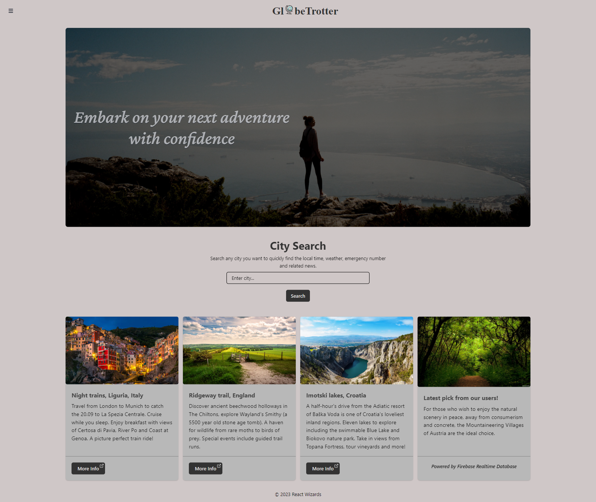
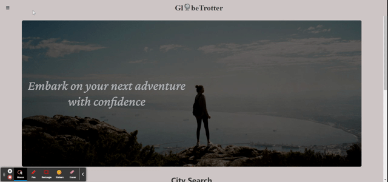

<a name="top"></a>

# GlobeTrotter

       



## Description

Globe Trotter was created to be a companion app for travellers. It includes a currency conversion tool, a translation tool which detects the input language and converts to English, and an information tool which allows users to search for cities and see various information, such as the current time, weather, emergency services number and third party links to a selection of news articles.

## Table of contents

- [User Story](#user-story)
- [Acceptance Criteria](#acceptance-criteria)
- [Getting Started](#getting-started)
- [What We Learned](#what-we-learned)
- [Selected Features](#selected-features)
- [Limitations and Future Enhancements](#limitations-and-future-enhancements)
- [Contribution](#contribution)
- [Credits](#credits)
- [Licence](#licence)

## User Story

```
As a travel enthusiast, I want convenient access to resources that simplify my journey, so that I can have a stress-free holiday experience and be well prepared for any disruptions.
```

## Acceptance Criteria

```
GIVEN a travel-oriented web application

WHEN the page loads
THEN I am presented with the following with a polished and responsive UI:
An inspiring banner that gives me confidence in the app
The ability to search for a city
Information about the city I recently searched and the ability to clear searched city
Get some popular travel ideas
The ability to navigate easily between pages

WHEN I search for a city
THEN the city is saved and I am presented with the following information:
City name and country
Current weather
Current time and date
Local emergency services number
News relating to the city

WHEN I navigate to the translation page
THEN I am presented with a form that will allow me to submit  text in a foreign language and receive the english translation and what language the original text is in. The recent translation details also have to persist between page loads.

WHEN I navigate to the currency convertor page
THEN I am presented with a form that will allow me to submit the amount and currencies to convert, and receive the converted amount and the conversion rate. This data along with the date of the information has to be stored on my device and persist between page loads for recent queries.

WHEN I try to access a page that does not exist
THEN I am informed that the page does not exist, but also feel more connected with the application’s branding.

```

## Getting started

To view the deployed application visit the [Globe Trotter app](https://globetrotterreact.netlify.app/).

Alternatively, to run the app locally, download or clone the repository which can be found [here on GitHub](https://github.com/MrMaciejM/GlobeTrotter) and run the following command to install required dependencies

```
npm i
```

If you are new to React it is recommended to review the [React README](https://github.com/facebook/create-react-app/blob/main/packages/cra-template/template/README.md).

## What we learned

During this project, we gained valuable experience in various areas, including:

- Organizing and structuring a React application to improve code maintainability and scalability
- Writing JSX code to render dynamic user interfaces and enhance front-end browser functionality
- Working with multiple APIs in an efficient and error-resistant manner to fetch and manipulate data
- Leveraging third-party libraries, such as React Hook Forms, Moment, and Axios, to simplify complex tasks and speed up development
- Exploring a new CSS framework (Chakra UI) to create visually appealing and responsive user interfaces
- Implementing a real-time chat feature using Firebase, a cloud-based NoSQL database, to enhance user engagement and collaboration
- Enhancing the user experience by incorporating small animations when navigating between different pages
- Deploying the web app to Netlify, a cloud-based platform for continuous deployment and hosting, to make it accessible to a wider audience.

Overall, this project provided us with a comprehensive understanding of modern web development tools and techniques, and gave us the opportunity to apply our knowledge in a practical setting. We look forward to using these skills in future projects and continuing to improve our abilities as developers.

## Selected Features

### Translation tool



The translation tool allows users to input words or phrases for translation. The app detects the language of the text and translates to English. Previous searches are saved to local storage and displayed in a tabular format.

### Currency Conversion


The currency conversion tool allows users to input a numeric value and the currencies to convert from and too. One submitted the amount, vonverted value and exchange rate are displayed in tabular format.

### City Search


The city search tool allows users to input a city name and retrieve information such as the local time, weather and emergency services phone number as well as an image related to the city and a selection of third party links to news articles.

## Limitations and Future Enhancements

Despite the progress we've made, there are still some limitations to our web app that we could address:

- The code could be refactored to improve its readability and organization, particularly in terms of breaking down larger components into smaller ones and creating folders for helper utils, data, and pages.
- The currency converter tool only accepts recognized short-form currency codes, such as USD or EUR. We plan to expand its functionality to accept more currency codes in the future.
- The translation tool only translates into English at this time, which may limit its usefulness for non-English-speaking users.

Moving forward, we could further develop and enhance our web app by:

- Refactoring and cleaning up the code base to improve its organization and readability. This will involve breaking down larger components into smaller ones where appropriate and creating separate folders for helper utils, data, and pages.
- Integrating the city search feature with the translation and currency tools so that users can be prompted to use the appropriate currency and language for their location.
- Allowing users to select their preferred language for translation from English.
- Implementing a user login system to personalize the user experience and save preferences across devices.
- Developing the Firebase real-time database feature into a live chat functionality, allowing users to engage in real-time conversations with each other.

By implementing these enhancements, we hope to make our web app more user-friendly, accessible, and useful to a wider range of users.

## Contribution

If you're excited about this project and want to get involved, that'd be awesome! Here are a few ways you can contribute:

1. Fork the repository and create a pull request with your changes.
2. Submit an issue to report bugs or request new features.
3. Help improve the documentation.

Please follow the guidelines for contributions:

- Make sure your code is well-documented and follows the same style as the rest of the codebase.
- Keep pull requests small and focused on a single change.
- Include test cases for any new features or changes.

If you have any questions or suggestions, feel free to contact us - we're on GitHub!

- <a href="https://github.com/AywinK">Aywin</a>
- <a href="https://github.com/DarrenOxley7">Darren</a>
- <a href="https://github.com/MrMaciejM">Maciej</a>
- <a href="https://github.com/shisinbin">Shivraj</a>

## Credits

- <a href="https://reactjs.org/">React</a>
- <a href="https://chakra-ui.com/">Chakra UI</a>

## Licence

MIT License

Permission is hereby granted, free of charge, to any person obtaining a copy
of this software and associated documentation files (the "Software"), to deal
in the Software without restriction, including without limitation the rights
to use, copy, modify, merge, publish, distribute, sublicense, and/or sell
copies of the Software, and to permit persons to whom the Software is
furnished to do so, subject to the following conditions:

The above copyright notice and this permission notice shall be included in all
copies or substantial portions of the Software.

THE SOFTWARE IS PROVIDED "AS IS", WITHOUT WARRANTY OF ANY KIND, EXPRESS OR
IMPLIED, INCLUDING BUT NOT LIMITED TO THE WARRANTIES OF MERCHANTABILITY,
FITNESS FOR A PARTICULAR PURPOSE AND NONINFRINGEMENT. IN NO EVENT SHALL THE
AUTHORS OR COPYRIGHT HOLDERS BE LIABLE FOR ANY CLAIM, DAMAGES OR OTHER
LIABILITY, WHETHER IN AN ACTION OF CONTRACT, TORT OR OTHERWISE, ARISING FROM,
OUT OF OR IN CONNECTION WITH THE SOFTWARE OR THE USE OR OTHER DEALINGS IN THE
SOFTWARE.

Copyright (c) 2023 React Wizards

<p align="right">
  <a href="#top">Back to top</a>
</p>
